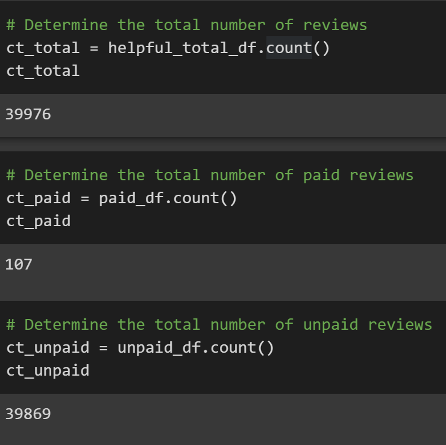

# Amazon Vine Analysis
## Project Overview
The purpose of this analysis is to provide an incite to the reviews written by members of the paid Amazon Vine program and determine if there is any bias toward favorable reviews from Vine members. This project looked at reviews of outdoor products.

Resources:
AWS, PostgresSQL, Google Colab (PySpark library), Amazon Outdoor Products Reviews dataset:
https://s3.amazonaws.com/amazon-reviews-pds/tsv/amazon_reviews_us_Outdoors_v1_00.tsv.gz
## Results
### Vine and Non-Vine Reviews
- Total reviews for Vine and Non-Vine members was 39,976.
    - 107 reviews were from Vine members, paying a membership
    - 39,869 reviews were from Non-Vine members

### 5-Star Reviews for Vine Members and Non-Members
- Total of 5-star reviews for Vine members and non-members was 21,061.
    - 56 reviews were from Vine members
    - 21,005 reviews were from non-members
- Percentages for 5-star reviews for Vine Members and Non-Members
    - 52.3% of Vine member reviews 
    - 52.7% of non-member reviews 

### Summary and Further Analysis

- Observing the percentage of reviews that were 5 stars from both Amazon Vine members and non-members, it can be concluded that there is no positivity bias for reviews of outdoor products in the Vine program. The percentage of five-star reviews from both groups are nearly the same, approximately 52%. Futher analysis could be conducted to compare the one-star or low reviews from both Vine members and non-members to support similar results.
